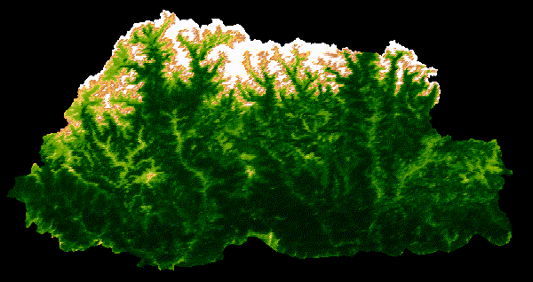

# Visualisation and Analysis of NDVI in Bhutan

I chose Bhutan as my country for the analysis. The NDVI is a dimensionless index that describes the difference between visible and near-infrared reflectance of vegetation cover and can be used to estimate the density of green on an area of land (Weier and Herring, 2000). 
NDVI is calculated as (NIR – Red) / (NIR + Red). 
NDVI values range from +1.0 to -1.0. Areas of barren rock, sand, or snow usually show very low NDVI values (for example, 0.1 or less). High NDVI values (approximately 0.6 to 0.9) correspond to dense vegetation such as that found in temperate and tropical forests or crops at their peak growth stage. Bhutan has often been regarded as the greenest country in the world. One of Bhutan's significant natural resources in the late twentieth century was its rich forests and natural vegetation. In 1972, while every other country was focusing on GDP, Bhutan’s fourth king, Jigme Singye Wangchuck introduced the Gross National Happiness (GNH) concept. He passed rules mandating that every household should get permission to extract firewood. The export of timber was banned and community forestry was encouraged (Livemint.com). Bhutan is the world’s only Carbon negative country.  We can observe great mountainous regions in the north and high vegetation regions in the middle of the country ranging to the southern part. NDVI is mapped to a color gradient from tan to dark green representing low to high photosynthetic capacity (low to high vegetation cover density/ productivity).  Over 71% of its territory is under forest cover. Over 800 million trees are estimated to be found in Bhutan. 

